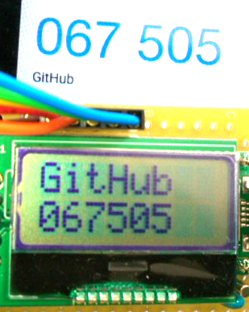
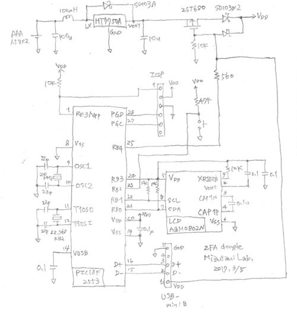
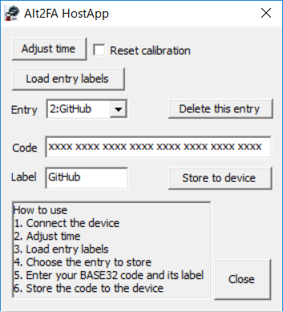

# Alternative Two-Factor Auth Dongle
A standalone two-factor authentication device that work with GitHub, Google, Facebook, and so on  
This device is not a fake.  
 

# Schematic
A very standard one.  
 

# Host app
 
